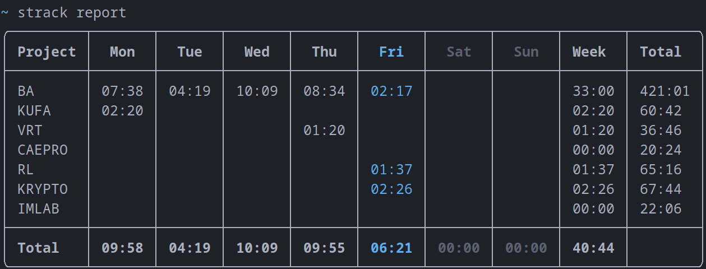
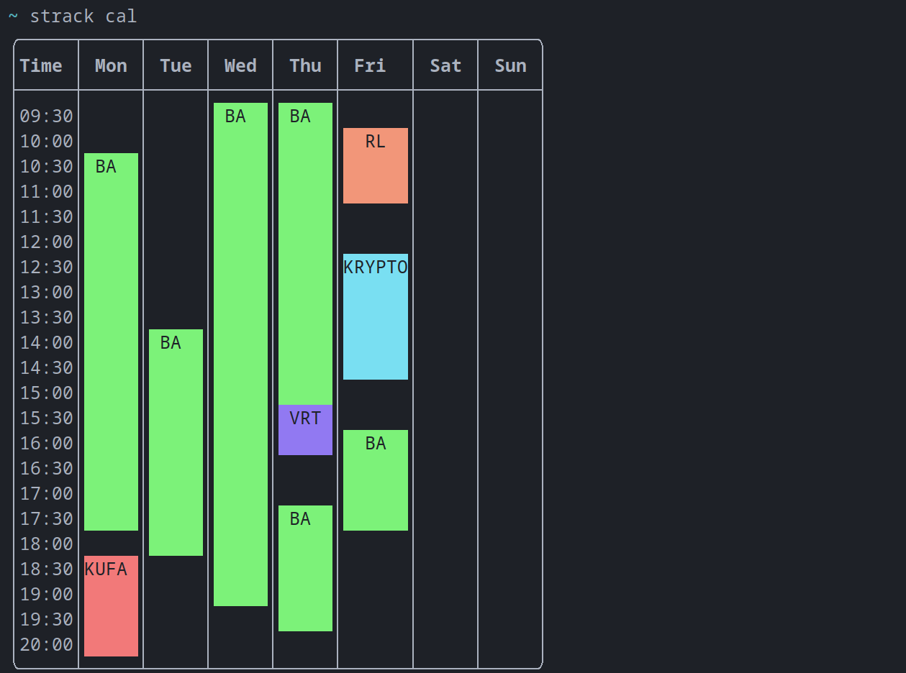

# 🕐 strack

Strack is command line utility to track the time spent on a project or task. I developed this because I wanted to find out how much time I was spending on each of my classes.

## Getting started

strack can be installed with the following command:

```
$ python -m pip install .
```

If you intend to modify the source code, use this instead:

```
$ python -m pip install -e .
```

## Sessions

### Staring a session

You can start tracking a project by using the following command:

```
$ strack start <project name>
Project "<project name>" doesn't exist.
Do you want to create it? [y/n]: y
<project name> is now active.
```

This will create a new session starting at the current time. The `-t/--time` flag can be used to specify the start time in the `HH:MM` format.

### Monitoring current session

To monitor the currently tracked session, the `status` command can be used:

```
$ strack status
Active project: <project name>
Current session: 03:31 started at 10:49
Today: 03:31
Week: 03:31
Total: 04:23
```

### Stopping a session

Once you are done, the `stop` command can be used to stop tracking. The `-t/--time` flag can be used to specify the time in the `HH:MM` format.

```
$ strack stop
Session <project name> stopped (Duration: 03:32)
```

## Visualisation

There are multiple ways to visualise the data.

### Report

The `report` command shows a tabular view of the current week. It lists each project and shows how much time was spent on it each day, in that week and in total. It also shows how much time was spent tracking for each day.



### Calendar

The `cal` command shows a graphical view of the current week.



### List

The list view shows the sessions.

## Managing Projects

The `project` command contains sub-commands to manage projects.

```
$ strack project add <project name>
$ strack project remove <project name>
$ strack project rename <project name> <new project name>
$ strack project list
```

### Project color

Each project has a color associated with it. When a project is created, a color is chosen at random. This color can be changed by using the `project set-color` command.

```
$ strack project set-color <project-name> <color>
```

`<color>` can be the name of a color or a HEX value. The special value `random` will result in a random color being used.
